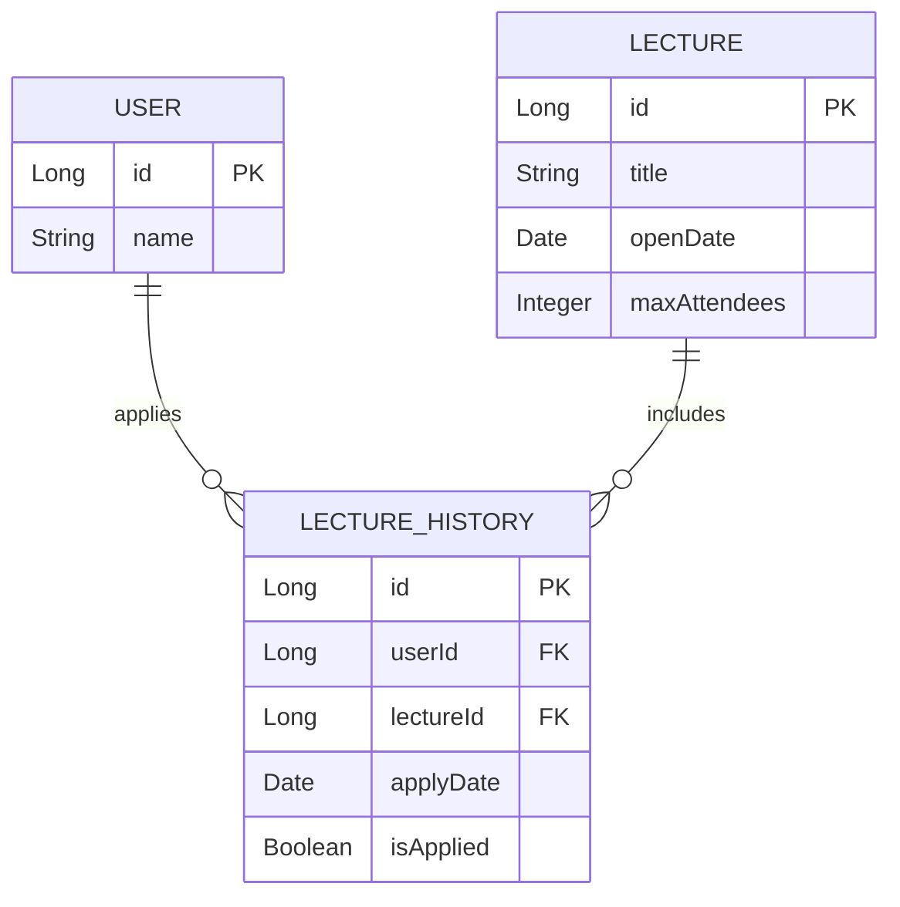

## ERD

	1.	USER 엔터티
		id: 각 유저를 고유하게 식별할 수 있는 기본 키(Primary Key)입니다.
		name: 유저의 이름을 저장합니다.
		설계 당위성: USER 엔터티는 시스템을 사용하는 개인을 나타내며, 기본적인 유저 정보를 관리합니다. 기본 키는 유저를 고유하게 식별하기 위해 필요합니다.
	2.	LECTURE 엔터티
		id: 각 강의를 고유하게 식별할 수 있는 기본 키입니다.
		title: 강의의 제목을 저장합니다.
		openDate: 강의가 시작되는 날짜를 저장합니다.
		maxAttendees: 강의에 참가할 수 있는 최대 참가자 수를 나타냅니다.
	3.	LECTURE_HISTORY 엔터티
		id: 각 강의 신청 내역을 고유하게 식별할 수 있는 기본 키입니다.
		userId: 신청한 유저를 참조하는 외래 키(Foreign Key)입니다.
		lectureId: 신청한 강의를 참조하는 외래 키입니다.
		applyDate: 유저가 강의에 신청한 날짜를 저장합니다.
		isApplied: 신청 상태를 나타내는 불리언 값입니다.
	4.	엔터티 간의 관계
		USER와 LECTURE_HISTORY: 유저는 여러 강의에 신청할 수 있으며, 이는 일대다 관계로 나타납니다. 유저는 LECTURE_HISTORY 엔터티를 통해 강의에 신청합니다.
		LECTURE와 LECTURE_HISTORY: 하나의 강의는 여러 유저에 의해 신청될 수 있으며, 이는 일대다 관계로 나타납니다. 각 강의는 LECTURE_HISTORY 엔터티를 통해 유저와 연결됩니다.
		설계 당위성: 이 관계는 실제 유저와 강의 간의 상호작용을 정확하게 반영합니다. LECTURE_HISTORY 엔터티를 통해 유저와 강의 간의 다대다 관계를 효과적으로 관리할 수 있습니다. 이는 데이터의 중복을 최소화하고, 유저와 강의 간의 연결을 효율적으로 유지할 수 있게 합니다.
