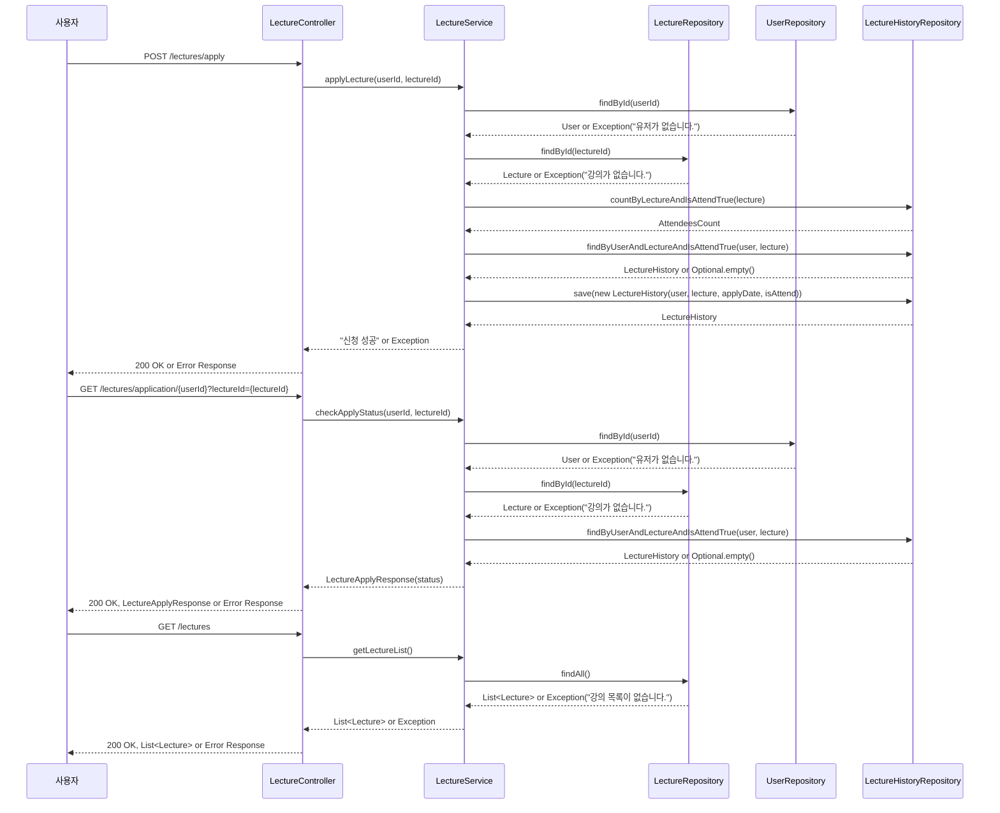

## 시퀀스 다이어그램

```mermaid
sequenceDiagram
    participant 사용자
    participant 컨트롤러 as LectureController
    participant 서비스 as LectureService
    participant 특강리포지토리 as LectureRepository
    participant 사용자리포지토리 as UserRepository
    participant 특강마스터리포지토리 as LectureHistoryRepository

    사용자 ->> 컨트롤러: POST /lectures/apply
    컨트롤러 ->> 서비스: applyLecture(userId, lectureId)
    서비스 ->> 사용자리포지토리: findById(userId)
    사용자리포지토리 -->> 서비스: User or Exception("유저가 없습니다.")
    서비스 ->> 특강리포지토리: findById(lectureId)
    특강리포지토리 -->> 서비스: Lecture or Exception("강의가 없습니다.")
    서비스 ->> 특강마스터리포지토리: countByLectureAndIsAttendTrue(lecture)
    특강마스터리포지토리 -->> 서비스: AttendeesCount
    서비스 ->> 특강마스터리포지토리: findByUserAndLectureAndIsAttendTrue(user, lecture)
    특강마스터리포지토리 -->> 서비스: LectureHistory or Optional.empty()
    서비스 ->> 특강마스터리포지토리: save(new LectureHistory(user, lecture, applyDate, isAttend))
    특강마스터리포지토리 -->> 서비스: LectureHistory
    서비스 -->> 컨트롤러: "신청 성공" or Exception
    컨트롤러 -->> 사용자: 200 OK or Error Response

    사용자 ->> 컨트롤러: GET /lectures/application/{userId}?lectureId={lectureId}
    컨트롤러 ->> 서비스: checkApplyStatus(userId, lectureId)
    서비스 ->> 사용자리포지토리: findById(userId)
    사용자리포지토리 -->> 서비스: User or Exception("유저가 없습니다.")
    서비스 ->> 특강리포지토리: findById(lectureId)
    특강리포지토리 -->> 서비스: Lecture or Exception("강의가 없습니다.")
    서비스 ->> 특강마스터리포지토리: findByUserAndLectureAndIsAttendTrue(user, lecture)
    특강마스터리포지토리 -->> 서비스: LectureHistory or Optional.empty()
    서비스 -->> 컨트롤러: LectureApplyResponse(status)
    컨트롤러 -->> 사용자: 200 OK, LectureApplyResponse or Error Response

    사용자 ->> 컨트롤러: GET /lectures
    컨트롤러 ->> 서비스: getLectureList()
    서비스 ->> 특강리포지토리: findAll()
    특강리포지토리 -->> 서비스: List<Lecture> or Exception("강의 목록이 없습니다.")
    서비스 -->> 컨트롤러: List<Lecture> or Exception
    컨트롤러 -->> 사용자: 200 OK, List<Lecture> or Error Response
```